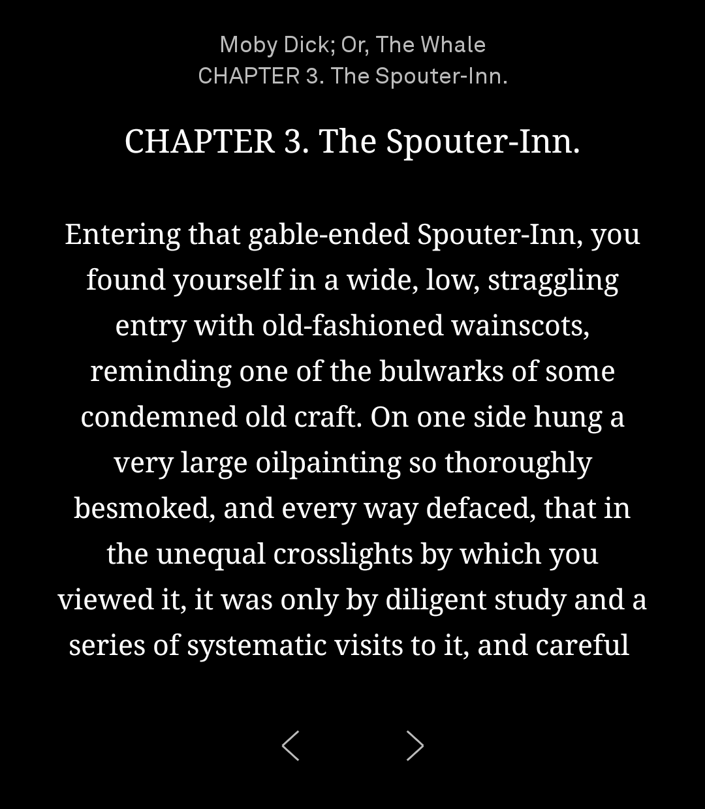
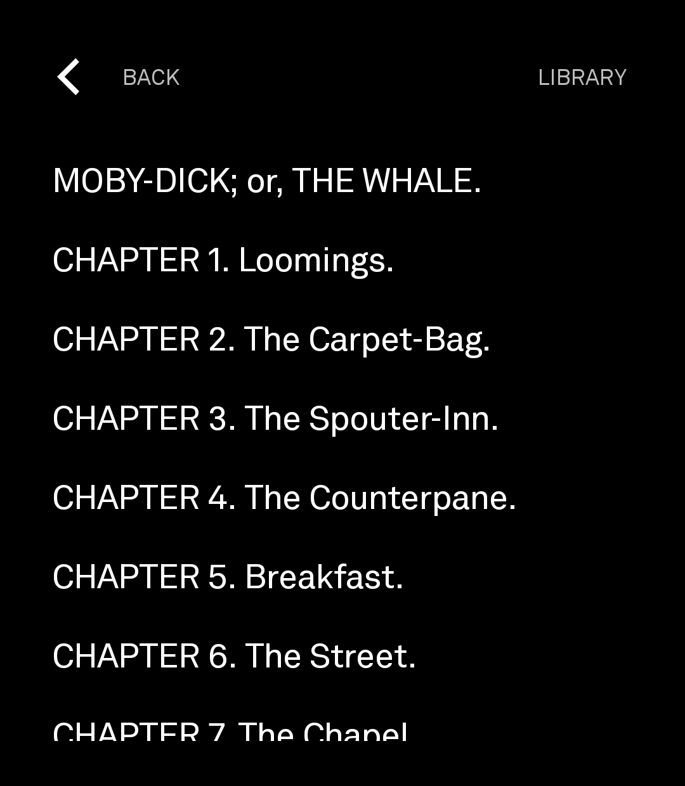

# Book Light

A plain e-reader for the [Light Phone](https://www.thelightphone.com/). One page
at a time, centred, with the book and chapter above and two chevrons below. It
remembers where you stopped in every book.

Built on the [Light SDK](https://github.com/lightphone/light-sdk).

<p align="center">
  
  
  
</p>

## How it works

Books are converted on a computer and read on the phone.

```
your.epub  ──  python tools/convert.py  ──▶  Your Book.book  ──▶  phone
```

That split is deliberate. The Light SDK sandbox allows no third-party libraries,
so nothing that can parse an EPUB or a PDF can run on the phone. Doing the work
on a computer, once, means the reader only ever opens one simple format — and it
means PDFs arrive as real reflowing text rather than as pictures of pages you
cannot read on a small screen.

## Getting a book onto the phone

Open the window:

```bash
python tools/app.py
```

Add some books, choose where the converted files should go, press Convert. Tick
"Also send to a plugged-in phone" and they go straight onto it. Tkinter comes
with Python, so this needs nothing installed. On Windows, `pythonw tools/app.py`
opens it without a console behind it.

Or from the command line:

```bash
python tools/convert.py "Moby Dick.epub"           # convert
python tools/convert.py "Moby Dick.epub" --push    # convert and send
```

Sending needs `adb` on PATH and USB debugging on.

### There is no folder on the phone to drop books into

Books live in the tool's own private directory, and a Light SDK tool cannot be
given permission to look anywhere else: the SDK's allowed-permission list has
no storage permission in it at all, and `Context` and the content resolver are
both out of reach. So a book downloaded on the phone — from a cloud drive, a
browser, anywhere — cannot be picked up, whatever folder it lands in.

USB is the route that works today. The tool also watches a `shared/inbox`
folder that LightOS itself can write into, which is how a transfer from the
phone side would arrive if LightOS offers one, but that is untested.

### What it can convert

| Format | Needs |
|---|---|
| EPUB, TXT, Markdown, HTML | nothing — plain Python |
| PDF | `pip install pymupdf` |
| MOBI, AZW3, DOCX, RTF, FB2 | [Calibre](https://calibre-ebook.com/download) on PATH |

A book bought from Amazon or another shop with DRM will not convert by any of
these routes. Public-domain books from [Project Gutenberg](https://www.gutenberg.org/)
work well and are what this was tested against.

## Reading

- **Tap the left third** of the page to go back, anywhere else to go on. So do
  the chevrons and the volume keys.
- **Tap the book and chapter at the top** for the contents. There is a back
  button on it.
- Every page turn is saved. Open the book again and it is where you left it —
  there is nothing to press.

The library lists whatever was read most recently first, with how far through
each book you are.

## Building it

```bash
./gradlew :tool:assembleDebug      # the one to install
./gradlew :tool:assembleRelease    # smaller, but see below
```

The APKs land in `tool/build/outputs/apk/`. Both are signed with the SDK's
development key.

**Install the debug build.** `adb` cannot write into an app's private folder,
so sending books over USB goes through `run-as`, and `run-as` only works on a
debuggable build. On the release build `push.py` fails with *"package not
debuggable"* and there is currently no other way to get a book onto the phone.
The release build is a third of the size and is what a proper signed
distribution would use, but until books can arrive by some other route it is
the wrong one to install.

`serverPackage` in [`tool/lighttool.toml`](tool/lighttool.toml) is set to
`com.lightos`, for a real Light Phone III. Change it to
`com.thelightphone.sdk.emulator` to run in the LightOS emulator instead.

Tests:

```bash
./gradlew :tool:testDebugUnitTest     # the reader
python tools/test_convert.py          # the converter
```

## How position is stored

A saved place is a chapter and a **character offset** — never a page number.
Pages depend on the type size, the margins and the screen, and none of those are
properties of the book. Storing an offset means the same words are found again
whatever the page turns out to be, including on a different phone.

## Light Phone 2

Not built yet. The plan is a second, ordinary Android app that shares this
project's core and draws its own screens for the smaller e-ink display.
Everything below the screen layer — the book format, pagination, saved progress
— is already free of the SDK and ready to be shared.

## Licence

MIT, as the SDK it is built on.
